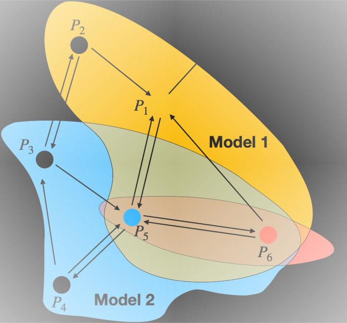
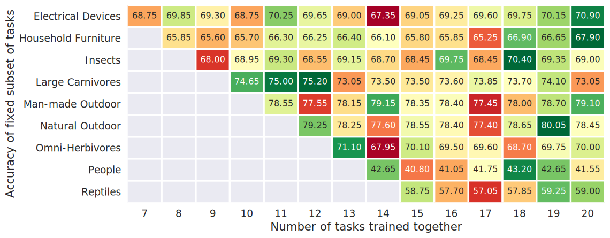
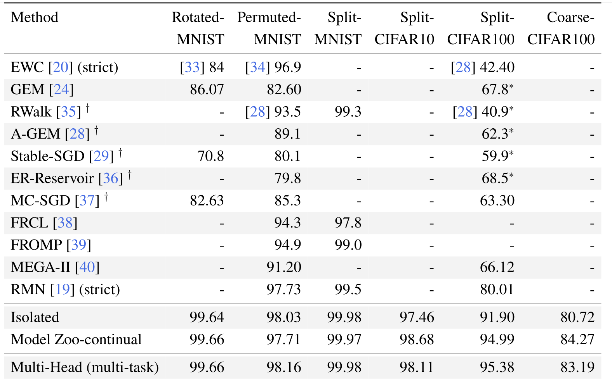
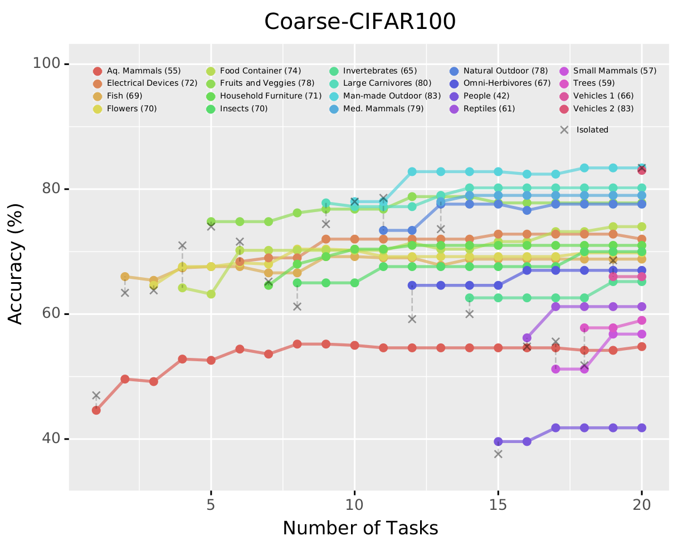

# Model Zoo for Multi-Task and Continual Learning
Implementation of [Boosting a Model Zoo for Multi-Task and Continual Learning](https://arxiv.org/abs/2106.03027)

Using a single shared backbone (multihead) is a ubiquitous approach to multi-task learning
and is an implicit design choice in areas like continual and meta-learning. The
below figure (right) shows that using such a learner on 20 tasks constructed from CIFAR100,
does not lead to monotonic improvements in performance across all tasks, as we increase the number of tasks.
The reason for the same can be attributed to the *dissonance amongst the tasks* as
a result of the limited capacity of a neural network.

Model Zoo explicitly addresses the same by increasing the
capacity of the model and grouping related tasks using a scheme inspired from
Boosting.

<p float="left">
  
  
</p>


We outperform existing multi-task learning algorithms and also achieve state of
the art accuracies on popular continual learning benchmarks. We also simultaneously
exhibit forward and backward transfer as show in the figure below (right).

<p float="left">
  
  
</p>


## Setup:

To install a working environment run:
```
conda env create -f env.yaml
```

## Usage

The two key executable files are `modelzoo.py` and `multihead.py`. The `-h`
flag can be used to list the argparse arguments. For example to run Multihead and Model Zoo, execute:

```
python multihead.py --data_config ./config/dataset/coarse_cifar100.yaml \
                    --hp_config ./config/hyperparam/default.yaml        \
                    --samples 100

python modelzoo.py --data_config ./config/dataset/coarse_cifar100.yaml \
                   --hp_config ./config/hyperparam/default.yaml        \
                   --num_rounds 10       \
                   --tasks_per_round 10  \
                   --samples 100
```

To run the continual learning variant of the Model Zoo, add the `--continual` flag. The tasks are presented sequentially with the order prescribed by the data config file.

## Directory Structure

```bash
├── config:                       # Configuration files
│   ├── dataset                    
│   └── hyperparam                  
├── datasets                      # Dataset and Dataloaders
│   ├── build_dataset.py          
│   ├── cifar.py                 
│   ├── data.py                 
│   ├── mnist.py               
│   ├── modmnist.py           
├── hpo.py                        # Hyper-parameter optimization
├── modelzoo.py                   # Implementation of Model Zoo
├── multihead.py                  # Implementation of Multihead
├── net                           # Neural network architectures
│   ├── build_net.py
│   └── wideresnet.py
└── utils                         # Utilities for logging/training
    ├── config.py
    ├── logger.py
    └── run_net.py
```

